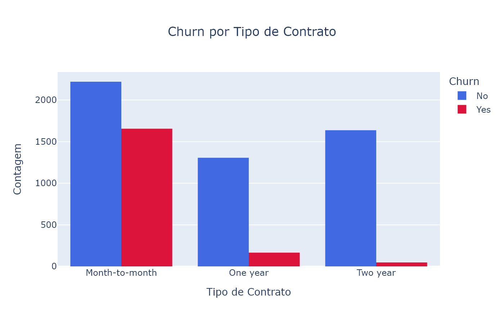
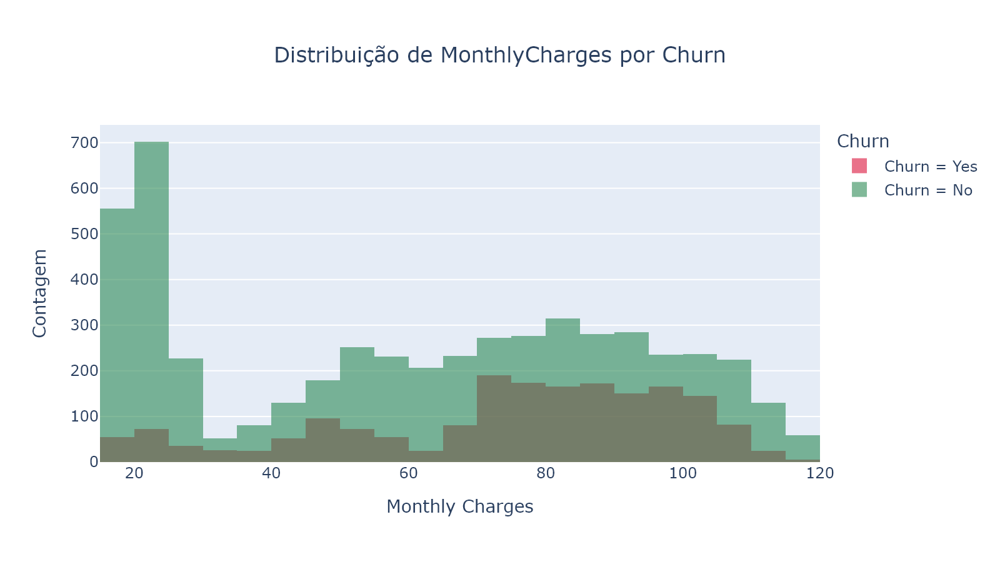
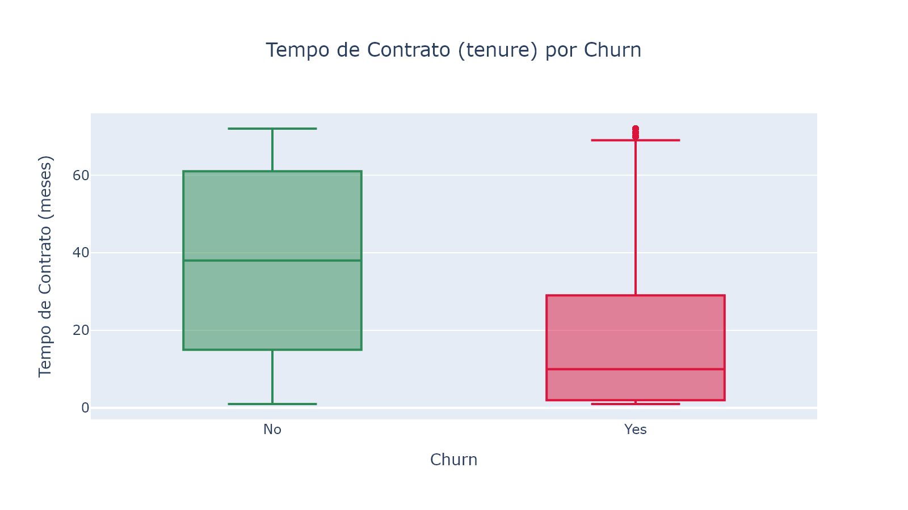
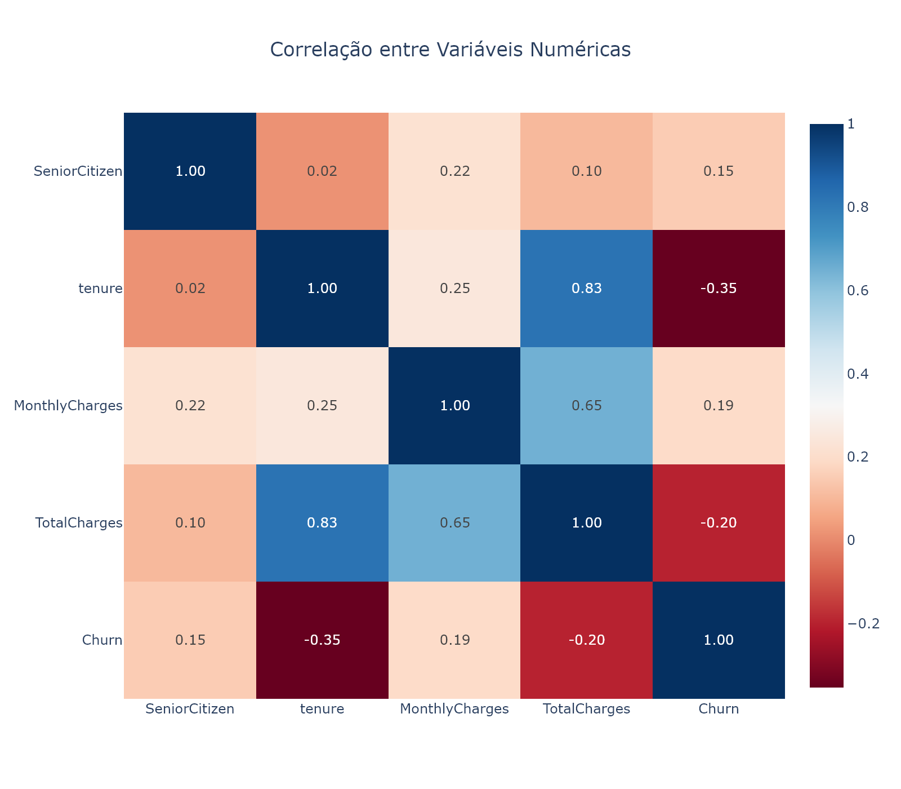
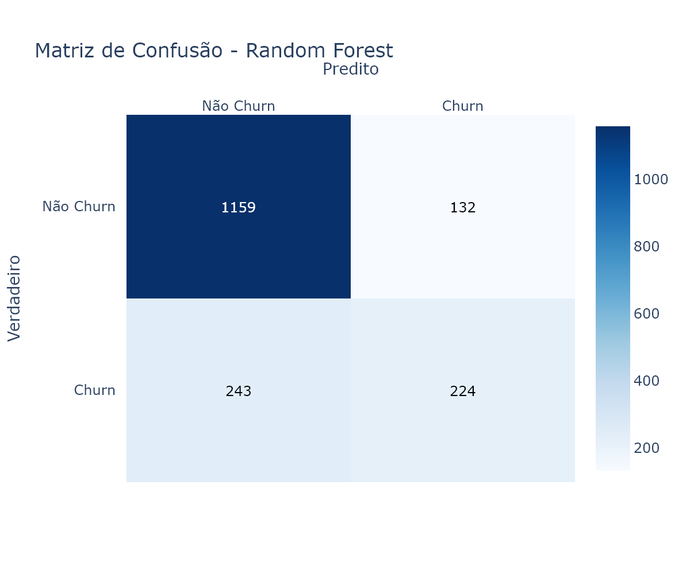

# ChurnGuard: Previsão de Evasão de Clientes no Varejo com Machine Learning

#### 🎯 Objetivo do Projeto

Este projeto tem como objetivo prever quais clientes têm maior probabilidade de abandonar uma empresa (churn), utilizando técnicas de classificação supervisionada. Essa previsão é essencial para estratégias de retenção e campanhas personalizadas no varejo e serviços.

---

### ⚙️Criando env

```
conda create --name cases_data_science python=3.10
conda activate cases_data_science
```

Se precisar deletar env

```
conda remove --name cases_data_science --all
```

Exportar notebook para md

```
jupyter nbconvert notebook.ipynb --to markdown --no-input

```

Criando env com environment.yml

```
conda env create -f environment.yml
conda activate nome_env
```

---

#### 📊 Fonte e Explicação dos Dados

- **Fonte:** [Kaggle - Customer Churn Dataset](https://www.kaggle.com/datasets/blastchar/telco-customer-churn)
- **Descrição:** Contém dados demográficos, de serviço e de faturamento de clientes de uma operadora de telecomunicações. É amplamente usado para estudos de churn.
- **Coluna alvo:** `Churn` (Yes/No)
- **Principais variáveis:** `gender`, `SeniorCitizen`, `tenure`, `MonthlyCharges`, `Contract`, `PaymentMethod`, etc.

---

### 📁 Estrutura de Pastas e Arquivos

```
churn-prediction-retail-customers/
│
├── data/
│   └── telco_churn.csv
│
├── notebooks/
│   ├── 01_eda.ipynb
│   ├── 02_preprocessing_modeling.ipynb
│   ├── 03_evaluation_visualization.ipynb
│
├── requirements.txt
├── README.md
└── .gitignore

```

---

#### 🔄 Etapas do Processo

1. **Coleta dos dados:** via Kaggle
2. **Limpeza e pré-processamento:** encoding, missing values, normalização
3. **Análise exploratória:** churn vs variáveis, visualizações
4. **Modelagem:** modelos de classificação (Logistic Regression, Random Forest, XGBoost)
5. **Avaliação:** métricas como accuracy, F1, ROC AUC
6. **Interpretação e visualização dos resultados**

---

### ⚙️ Como Executar Localmente

1. Clone o repositório:

```
git clone https://github.com/seunome/churn-prediction-retail-customers.git
cd churn-prediction-retail-customers.git
```

2. Crie um ambiente virtual (opcional) e instale as dependências:

```
pip install -r requirements.txt
```

3. Inicie os notebooks:
   ```
   jupyter notebook
   ```

Execute os notebooks em ordem para visualizar todo o pipeline.

---

### 📊 Salvar gráficos

Plotly precisa da biblioteca **kaleido** para exportar gráficos como imagem:

```
pip install -U kaleido
```

---

## ✅ Resultados

### 📉 Churn por Tipo de Contrato

A análise do churn por tipo de contrato revela que **clientes com contratos mensais** são significativamente mais propensos a cancelar o serviço, enquanto os contratos com duração anual apresentam taxas de churn muito menores.

Esse comportamento indica que contratos mais longos tendem a **reter melhor os clientes** , sendo um ponto estratégico para reduzir evasões.



### 💸 Distribuição das Cobranças Mensais (Monthly Charges)

A distribuição das cobranças mensais mostra que clientes com churn tendem a pagar **valores mensais mais elevados** . Esse padrão sugere que preços mais altos podem estar relacionados à **insatisfação ou dificuldade de retenção** , sendo um possível fator de risco para cancelamentos.



### ⏳ Tempo de Contrato (Tenure) por Churn

Clientes que **cancelaram o serviço (Churn = Yes)** costumam ter contratos com menor tempo de duração. A mediana de _tenure_ entre os churners é visivelmente menor, reforçando a importância de estratégias de retenção nos **primeiros meses de contrato** .



### 🔗 Correlação entre Variáveis Numéricas

A matriz de correlação destaca as relações entre variáveis numéricas no conjunto de dados. Por exemplo, observa-se uma **correlação positiva entre `MonthlyCharges` e `TotalCharges`** , além de uma **relação negativa entre `tenure` e `Churn`** , sugerindo que clientes antigos tendem a permanecer na base.



## Resultados da Classificação de Churn

Foram avaliados dois modelos populares de machine learning para prever a saída de clientes (churn): **Random Forest** e **XGBoost** . A seguir, os principais resultados obtidos no conjunto de teste:

### Random Forest

- **Acurácia:** 79%
- **Precision (Classe 1 - Churn):** 0.63
- **Recall (Classe 1 - Churn):** 0.48
- **F1-Score (Classe 1 - Churn):** 0.54
- **ROC AUC:** 0.82

Matriz Confusão:



O modelo apresenta bom desempenho para identificar clientes que não sairão (classe 0), porém a detecção de churn ainda pode ser melhorada, dado o recall moderado para a classe positiva.

### XGBoost

- **Acurácia:** 77%
- **Precision (Classe 1 - Churn):** 0.58
- **Recall (Classe 1 - Churn):** 0.49
- **F1-Score (Classe 1 - Churn):** 0.54
- **ROC AUC:** 0.81

Matriz Confusão:


O XGBoost alcançou resultados similares, com leve queda na acurácia e área sob a curva ROC. Ambas as abordagens demonstram equilíbrio entre precisão e recall, mas indicam a necessidade de melhorias para aumentar a sensibilidade à classe de churn.

Esses resultados indicam que os modelos podem ser úteis para monitorar churn, mas é recomendado explorar técnicas adicionais, como ajuste de hiperparâmetros, amostragem balanceada ou inclusão de novas variáveis para melhorar a identificação de clientes em risco de saída.

---

### Licença

Este projeto está sob a licença MIT - veja o arquivo [LICENSE](./LICENSE) para detalhes.

---

### Contato

LinkedIn: [linkedin.com/in/heitorandradeoliveira](https://linkedin.com/in/heitorandradeoliveira)

---
